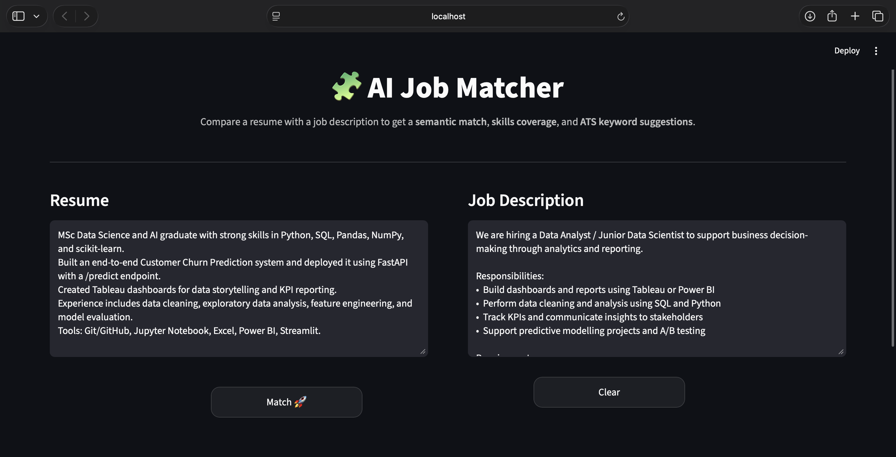
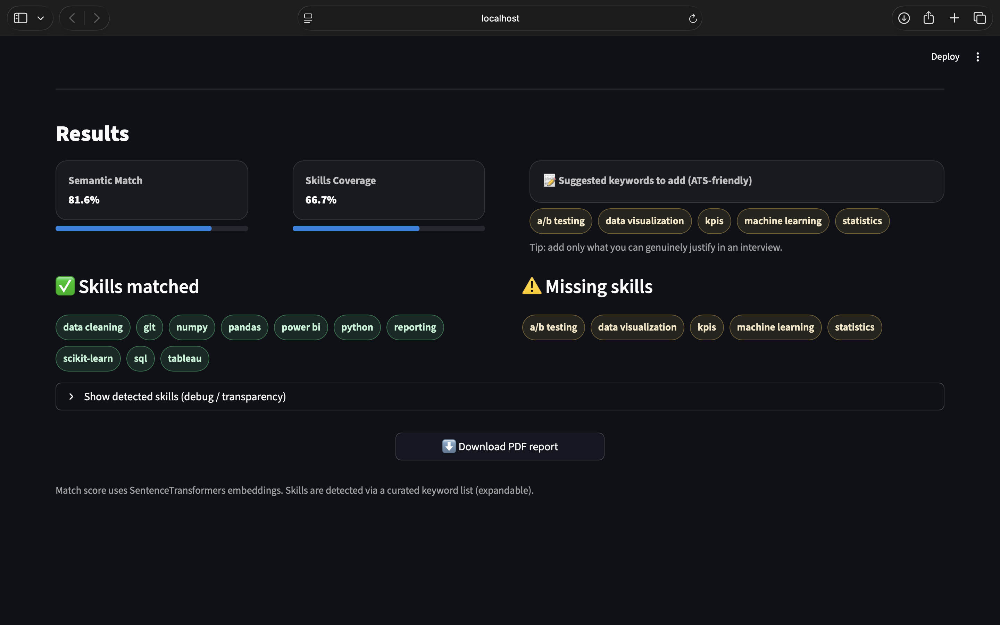

# 🧩 AI Job Matcher (Resume vs Job Description)

AI Job Matcher is a **Streamlit + NLP** app that compares a **resume** with a **job description** and generates an ATS-style analysis to help job seekers tailor their resumes.

## 📸 Screenshots

### Input Screen


### Results Screen


## 🚀 Features
- **Semantic Match Score** using Sentence-Transformers embeddings  
- **Skills coverage analysis** (matched & missing skills)  
- **ATS keyword suggestions**  
- **Downloadable PDF report**

## ⚙️ How it works
1. Extracts resume text from PDF  
2. Encodes resume + job description using embeddings  
3. Computes similarity score (match %)  
4. Finds missing skills and suggests improvements  
5. Generates a PDF report

## ▶️ Run locally

```bash
git clone https://github.com/DeeptiChandrakantPatil/ai-job-matcher.git
cd ai-job-matcher

python3 -m venv env
source env/bin/activate

pip install -r requirements.txt
streamlit run app/app.py

📂 Project Structure
ai-job-matcher/
  app/
    app.py
  assets/
    app_input.png
    app_results.png
  requirements.txt
  .gitignore
  README.md
```
💡 Future Improvements

Skill synonym matching (e.g. “NLP” ↔ “Natural Language Processing”)

Better resume section parsing (Experience / Projects / Skills)

Deploy on Streamlit Cloud

Add tests + CI pipeline